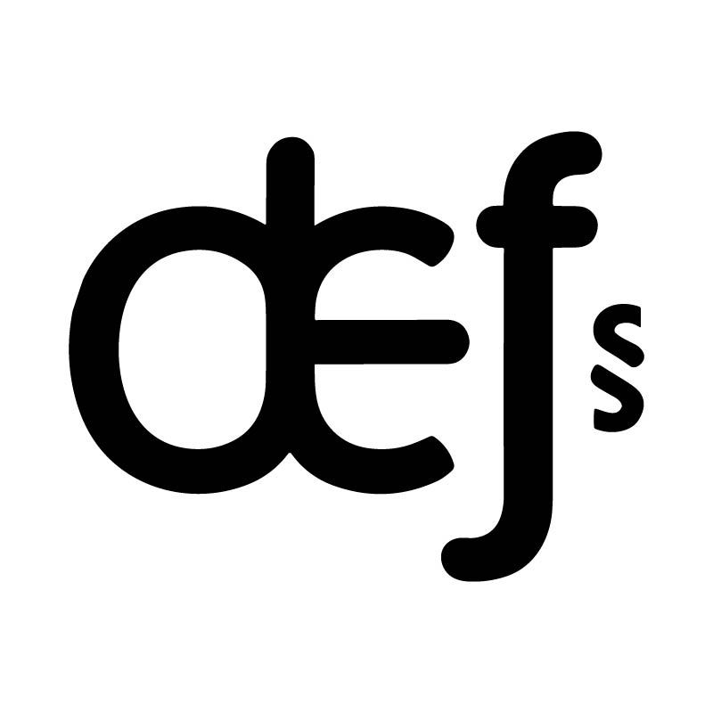

<p align="center">
  <a href="https://vitejs.dev" target="_blank" rel="noopener noreferrer">
    
  </a>
</p>
<br/>
<p align="center">
  <a href="https://npmjs.com/package/@defjs/core"></a>
  <a href="https://npmjs.com/package/@defjs/core"></a>
  <a href="https://github.com/defjs/defjs/actions/workflows/ci.yml"></a>
  <a href="https://github.com/defjs/defjs/blob/main/LICENSE"></a>
  <a href="https://codecov.io/gh/defjs/defjs"></a>
</p>
<br/>

## Introduction

`def` is an abbreviation for `define`, so it can be read as `define js`.

Defjs is a library that helps you define and initiate requests, aiming to make it easier for you to define requests without worrying about the details.

-	Supports multiple request methods such as [Fetch](https://developer.mozilla.org/en-US/docs/Web/API/Fetch_API), [XMLHttpRequest](https://developer.mozilla.org/en-US/docs/Web/API/XMLHttpRequest), custom, etc.
-	Functional API.
-	🚧 Supports streaming. (WIP)
-	Supports JS/TS with complete type.
-	Supports any JS runtime.
-	Supports Interceptors.
-	Supports ESM
-	🚧 Supports Mini Programs. (WIP)

## Quick Start

> Use for package manager
```shell
npm install @defjs/core
// or
yarn install @defjs/core
// or
pnpm install @defjs/core
// or
bun install @defjs/core
```

> Use for CDN

**Only can use ES modules**

```html
<script type="module">
  import {
    createGlobalClient,
    defineRequest,
    field
  } from 'https://unpkg.com/@defjs/core/index.min.js';

  /**
   * @title Step 1
   * @file src/main.ts
   * @description Setting up a global client
   */
  createGlobalClient({
    host: 'https://example.com',
  });

  /**
   * @title Step 2
   * @file src/lib/api/user.ts
   * @description Define the request api request in the lib/api directory of the project
   */
  const useGetUser = defineRequest('GET', '/v1/user/:id')
    .withField(
      field(0).withParam()
    )

  /**
   * @title Step 3
   * @file src/pages/home.ts
   * @description Use defined requests in business code
   */
  const { doRequest } = useGetUser();

  await doRequest(1);
</script>
```

## Documentation

Check out the [defjs.org](https://defjs.org) to get started.

## Packages

| Package                      | Version                                                        |
|------------------------------|:---------------------------------------------------------------|
| [@defjs/core](packages/core) |  |

## Todo

- Wechat mini programs handler
- XMLHttpRequest handler
- 100% test coverage
- CLI Tool
  - Generate API from OpenAPI

## License

[MIT](LICENSE)

## Idea Reference

- [Angular HttpClient](https://angular.dev/guide/http)
- [Axios](https://axios-http.com)
- [Zod](https://zod.dev)
- [Deepkit Framework](https://github.com/deepkit/deepkit-framework)
- [tRPC](https://trpc.io)
- [Google API design guide](https://cloud.google.com/apis/design)
- [Tanstack Query](https://tanstack.com/query)
- [Rxjs](https://rxjs.dev)
